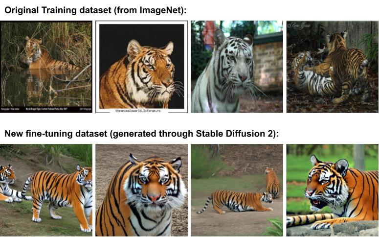

Thank you for your response! Since we have clarified all previous concerns and below we clarify new concerns experimentally, we sincerely hope the reviewer can reconsider the score. 

The proposed method indeed generates a diverse set of task specific explanations. This is how a practical pipeline would look like. Consider an autonomous vehicle hit a pedestrian. If we apply the proposed method, it will provide a diverse set of explanations (say, 5 explanations - typical XAI methods would provide only one). Then the analyzing human looks at each explanation to rule out the real cause. If we did not have a diverse set of explanations, there is a good chance we would have missed the real cause. 

Below we provide a concrete experiment that shows how diverse explanations help resolve issues in neural networks. 

In this experiment, we choose a pretrained Googlenet classifier for the Tiger class whose important seed prompts were ‘orange black and white’, ‘orange and black’, and ‘blurry image’ with TCAV scores of 0.66, 0.66, and 0.62, respectively. Out of these seed prompts, ‘orange black and white’ and ‘orange and black’ highlight the tiger pixels while ‘blurry image’ seed prompt highlights the background pixels (see sample explanations below). What that means is, in order to classify a tiger, Googlenet looks at both the foreground and background. Now the engineers want the classifier to classify the tiger based on tiger pixels, not its background (note: from the classical Wolfe-Husky example in LIME [1], we know the spurious correlation of background). 

  
   
  
Figure 2: Explaination mapping between concepts learned and input for pretrained GoogleNet classifier on Tiger class.

To this end, we generated 100 concept images based on concepts related to ‘orange black and white’ and ‘orange and black’ using a separate generative model and fine-tuned our Googlenet model. Running RLPO on this fine-tuned model revealed that the model learned some new concepts such as ‘whiskers’ and also revealed that previous concepts such as ‘orange black and white’ and ‘orange and black’ are now more important with TCAV scores of 1.0 and 1.0, respectively. This means that the classifier is now only looking at tiger pixels, not the background. (see dataset samples and shift plot  below).

This experiment clearly shows how the proposed method can be used to improve a neural network’s undesirable behavior.

1. Ribeiro, Marco Tulio, Sameer Singh, and Carlos Guestrin. "" Why should i trust you?" Explaining the predictions of any classifier." Proceedings of the 22nd ACM SIGKDD international conference on knowledge discovery and data mining. 2016.

  
   
  
Figure 3: Dataset samples.

  
   
  
Figure 4: Fine-tuning based on important concept.

