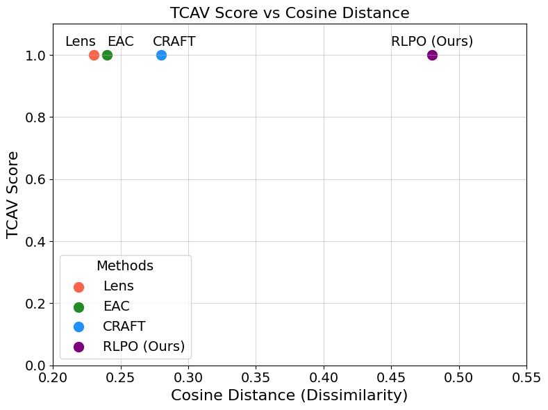

We are thankful to the reviewer for the detailed feedback. While we appreciate the reviewer's recognition of the interesting questions posed and the novel directions explored in our work, we believe there are some key misunderstandings regarding the goals and contributions of the proposed method. 

Since there are various types of contributions such as frameworks, datasets, algorithms, insights, applications, etc. at ICLR, we would like to clarify that our paper is an algorithmic contributions paper. Please see our detailed answers below. 

### Weakness 1

<b>Are our goals misaligned with XAI?</b>
We would like to clarify that the stated goals of our work are not misaligned with the broader goals of explainable AI (XAI). Our primary objective, consistent with XAI and what the reviewer states, is to improve the user’s understanding of the model. However, there is more nuance to this broad goal. The focus on "novelty,"  that most existing methods cannot provide, is not a deviation from this goal but rather an added dimension to further this goal. While we appreciate the reviewer's perspective, we probably do not want to fix the goals of XAI as it’s an evolving field.

Unlike in the most classical setting of XAI where we want to come up with explanations of a particular decision that helps a non-ML-expert user (e.g., say, a medical doctor), our goal is to provide insights to expert machine learning engineers or data scientists to identify what the neural network has learned (so that if there are any vulnerabilities they can fix before deployment). As highlighted in recent discussions [1] and our paper (Figure 2), humans cannot understand everything a neural network has learned because they do not learn using the same concepts that we learn–their learning manifold is different to ours. If a human were to manually come up with a concept set, they are going to miss important concepts because they do not know about the neural network’s learning manifold and therefore the engineers cannot fix the vulnerabilities of the network. That is why we need a method to automatically probe millions of concept configurations and see what really matters. Since trying millions of configurations is not computationally feasible, we formulate a deep RL solution that generates concepts using diffusion. By doing so, we do not deviate from the original goal. 

We believe that "abstractness" is an interesting byproduct of RLPO, as correctly identified by R1, R3, and R4. They provide a layered understanding of the model’s reasoning, revealing both high-level and low-level concepts that contribute to its decisions—something that, for the best of our knowledge, the XAI community has never seen before. 

While we like the utility metric introduced in [2], it does not help measure novelty. If we crop part of an image as a concept, the utility score will be high, though this concept is not novel at all. Our argument is that there are other patterns/concepts that trigger the neural network (the goal of this work) and identifying them is important to fix the issues.  Please see Table 2 where we explain this gap between “what the human thinks” vs. “what the neural network has actually learned.” One motivation for closing this gap stems from our attempt to understand why neural networks perform badly for certain complex decision-making tasks.

1. Schut, Lisa, et al. "Bridging the human-ai knowledge gap: Concept discovery and transfer in alphazero." arXiv preprint arXiv:2310.16410 (2023).
2. Colin, Julien, et al. "What i cannot predict, i do not understand: A human-centered evaluation framework for explainability methods." Advances in neural information processing systems 35 (2022): 2832-2845.

### Weakness 2

We understand that the term "novelty" could be interpreted in multiple ways, and we appreciate the opportunity to clarify its intended meaning and significance in our work.

<b>Novelty as in different concepts.</b> This is not what we originally meant but because of RLPO’s exploration strategy we indeed get different concepts. See figure 6. Thank you for helping us identify this added advantage.

If we read lines 285-288, “Different actions may result in different explainable states, reflecting various high-level concepts inherent to f(·)....Also, it is possible for different actions to lead to the same explainable state.” - The first sentence tells about the novelty as in different concepts. The second sentence tells us if we have two semantically similar seeds (but the RL algorithm “initially” does not know they are similar initially), the RL algorithm will force SD to learn similar concepts. Therefore, we do not have to worry much about having semantically repeated seeds.

<i>Please see calculations below to validate this.</i>
| Metrics | Stripes-Running Concept | Running-Mud Concept | Mud-Stripes Concept |
|-------------------------------|-----------------------------|-----------------------------|-----------------|
| Average Cosine similarity | 0.677 ± 0.010 | 0.699 ± 0.0004 | 0.734 ± 0.0004 |
| Average Wasserstein distance | 8.1533 ± 0.057 | 7.850 ± 0.022 | 7.480 ± 0.033 |
| Average Hotelling's T-squared score | 7598.507 ± 84.5 | 13069.681 ± 2147.81 | 7615.731 ± 538.06 |
| Are they from the same distribution? | No | No | No |

<b>Novelty as in deviation from the test set.</b> We believe there is a misunderstanding here. We are not just generating concept images that are far away from test images. We are generating images that are far away from test images but “still provide a high TCAV score.” This is a challenging constrained optimization problem that we address using deep RL and diffusion. As the other reviewers also correctly identify, we do not think developing an algorithm to do this is trivial. <i>Please see the graph here for comparison.</i> The comparison to prior work is not trivial. Retrieval-based methods directly rely on the dataset, in its simplest form "cropping" parts of existing images to produce explanations. While such an approach can highlight important features in input images that help non-expert users understand the network’s decisions, it is inherently limited to patterns present in the dataset. RLPO, on the other hand, explores beyond the dataset, generating concepts that trigger the network–unveiling the vulnerabilities of a neural network help engineers fix issues of the neural network.

### Weakness 3

From an XAI perspective, the comparison might look unnecessary. However, since the major contribution of work is developing an algorithm, given the popularity of LLM feedback and human feedback these days, it raises the question why we use XAI feedback. We wanted to highlight the infeasibility of using LLM and human feedback mechanisms in our framework. If the reviewer thinks this comparison is confusing to have in the main paper, we can move it to supplementary. Let us know.

### Weakness 4

The key assumption in our work is that stable diffusion can generate realistic images given a prompt (and generative models will continue to grow in the coming years). If SD generates images that do not help us explain the output, RL will not optimize it further. Therefore, we do not see how this is a problem. Referring to Figure 5, the explanation of the tiger class progresses through levels of abstraction from high to low: the importance of zoos, followed by animals in zoos, then striped animals in zoos, and finally orange-and-black striped animals, and so on. At the highest level of abstraction, what this means is, images of zoos trigger for tigers whereas random abstract concepts such as, say, beach, do not trigger for tigers. This indeed helps verify engineers that the neural network, in this example, has learned the correct representation. 

### Weakness 5

We can still obtain explanations in real-time because TCAV can run in real-time. However, we agree that RLPO cannot create concept sets in real-time, mainly because of the diffusion fine-tuning step (unfortunately, good concepts, whether designed by a human or diffusion comes at a cost). However, we do not think there is a need to create concept sets in real time.  For instance, if we apply TCAV for identifying a disease from an X-ray, we can create the concept set using a test set before deployment, which will take a few hours, and then run TCAV in real-time. Hence, concept set creation is a one-time investment. In case of a long-term distribution shift in an application, we can keep adding concepts to the dictionary, if RLPO discovers anything new. On a different note, please also note that the traditional method of manually creating a concept set can not only be slow and labor intensive but also can miss the important concepts. In a real-world setting, retrieval methods or human designed concepts can be used as a starting set of concepts and expand it using RLPO to generate what retrieval or humans could not see/think of. 

Thank you for pointing out the typos. We have fixed them.
---

### Question 1

<u>Why RL?</u>
Using only GPT was indeed our first attempt, which proved to be inefficient. 

Note that the action space is not 20 seed prompts but the combination of the 20 seed prompts. Assuming 30 mins per run, it will take 2^20 * 30 = 182 years to do this if we brute-force. Since RL intelligently and dynamically picks which prompt combinations to use (and not use), RLPO takes only ~8 hours. Therefore, unlike a static ranking approach, our RL-based framework is much more pragmatic to handle unbounded generative models. The high epsilon case in Table 1 is somewhat similar (yet better) to brute forcing through the seed prompts. 

Images generated after fine-tuning for concept “stripes” for the zebra class with and without RL after 300 steps.

<b>Without RL</b>

  
  
  

<b>With RL</b>

  
  
  

### Question 2

Though theoretically plausible (e.g., when the seeds are “stripe” and “stripes”), we’d say the probability is negligible because, 1) as explained in Appendix C2, we remove repeated seeds in the first place and 2) RL will stop taking the same action if its not getting rewards. In our experiments, that never happened. 

### Question 3

It will generate both in-distribution and out-of-distribution concepts. Even with retrieval methods or human-created datasets, we will have both and we do not not see why it is a problem as we are generating concept images not test images. If the question is where would testing OOD behavior is useful:

1. Safety-Critical Domains: In applications like healthcare or autonomous driving, understanding how the model generalizes to rare or unexpected scenarios (potentially OOD-like) is crucial for trust and reliability.
2. Bias Detection and Debugging: Generated concepts can reveal biases or spurious correlations learned by the model, allowing for more targeted mitigation strategies.
3. Generalization and Robustness Analysis: Abstract concepts help analyze how the model reasons under different conditions, providing insights into its robustness.

### Question 4

Our method seeks to generate explainable concept images that reflect the model’s internal representations. As an application, if an adversarial method (e.g., perturbing the inputs) can find adversarial test points, we can explain it using TCAV. Our method will help to get better concepts for TCAV that humans might have not thought of but useful to explain those test points.

### Question 5

Training the RLPO framework takes approximately 6–8 hours for a particular class, depending on a workstation with a gaming GPU–most of the time is for SD fine-tuning. As explained under W5 above, please note that we have to run this only once (to pre-compute the concepts), not for every single test image. At test time, the run-time is the same as the TCAV–a few milliseconds to seconds.
