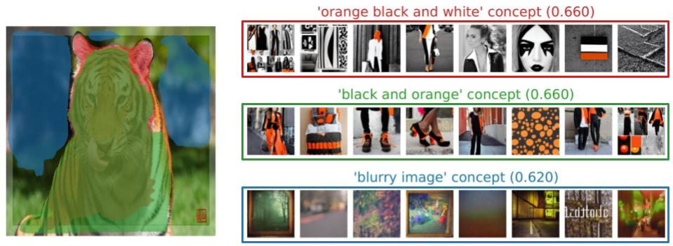
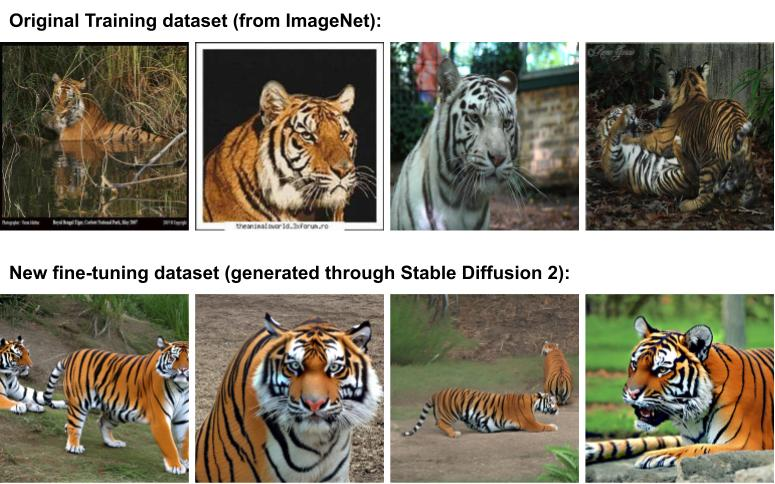

Thank you for the response! The reviewer’s new understanding about the claims is correct. Thank you for acknowledging that the paper has successfully demonstrated its claims. 

**Since we have clarified all of previous concerns and new concerns below through new experiments below, we sincerely hope the reviewer can reconsider the score.** As the reviewer can also see, we honestly put a lot of extra effort into rebutting 6 reviewers, mostly because this is not a classical XAI-style paper. We are sure that the reviewer also thinks that the contribution of the paper, the amount of experiments we have run, and the rebuttal is worth updating the score. Please see our answers below. 

The results presented in Figure 9 of the paper highlights a potential use case of the proposed method. It shows how concepts shift with fine-tuning and the proposed method’s ability to detect these new concepts. 

To further showcase the usefulness, we conducted an additional experiment. In this experiment, we choose a pretrained Googlenet classifier for the Tiger class whose important seed prompts were ‘orange black and white’, ‘orange and black’, and ‘blurry image’ with TCAV scores of 0.66, 0.66, and 0.62, respectively. Out of these seed prompts, ‘orange black and white’ and ‘orange and black’ highlight the tiger pixels while ‘blurry image’ seed prompt highlights the background pixels (see sample explanations below). What that means is, in order to classify a tiger, Googlenet looks at both the foreground and background. Now the engineers want the classifier to classify the tiger based on tiger pixels, not its background (note: from the classical Wolfe-Husky example in LIME [1], we know the spurious correlation of background). 

  
   
  
Figure 1: Explaination mapping between concepts learned and input for pretrained GoogleNet classifier on Tiger class.

To this end, we generated 100 tiger images based on concepts related to ‘orange black and white’ and ‘orange and black’ using a separate generative model and fine-tuned our Googlenet model. Running RLPO on this fine-tuned model revealed that the model learned some new concepts such as ‘whiskers’ and also revealed that previous concepts such as ‘orange black and white’ and ‘orange and black’ are now more important with TCAV scores of 1.0 and 1.0, respectively. This means that the classifier is now only looking at tiger pixels, not the background. (see dataset samples and shift plot below).

This experiment clearly shows how the proposed method can be used to improve a neural network’s undesirable behavior.

1. Ribeiro, Marco Tulio, Sameer Singh, and Carlos Guestrin. "" Why should i trust you?" Explaining the predictions of any classifier." Proceedings of the 22nd ACM SIGKDD international conference on knowledge discovery and data mining. 2016.

  
   
  
Figure 2: Dataset samples.

  
   
  
Figure 3: Fine-tuning based on important concept.

