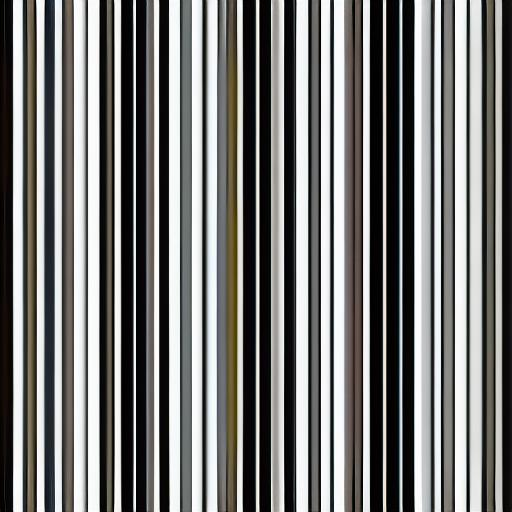
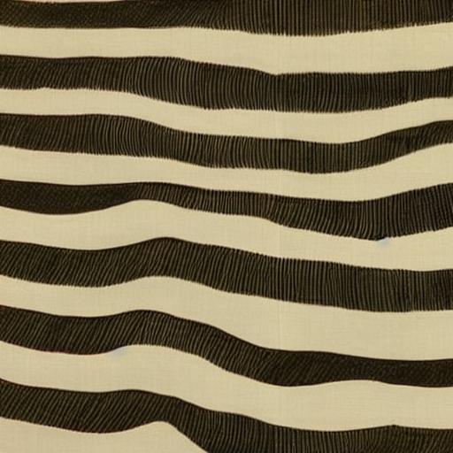
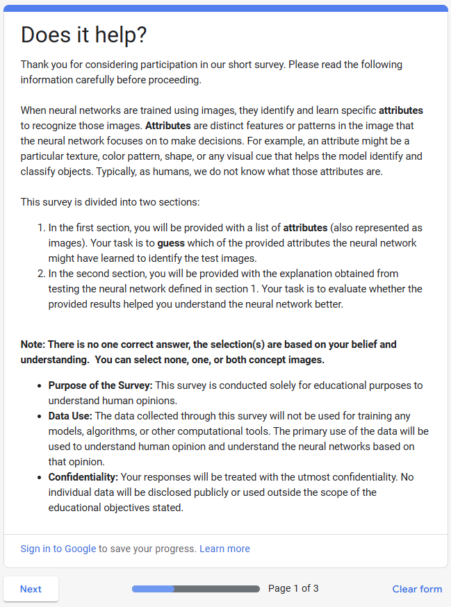
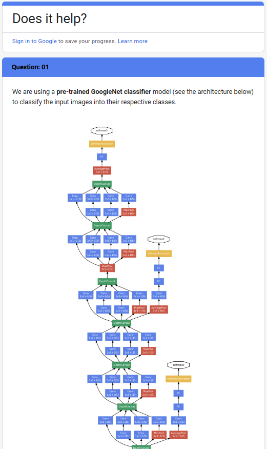
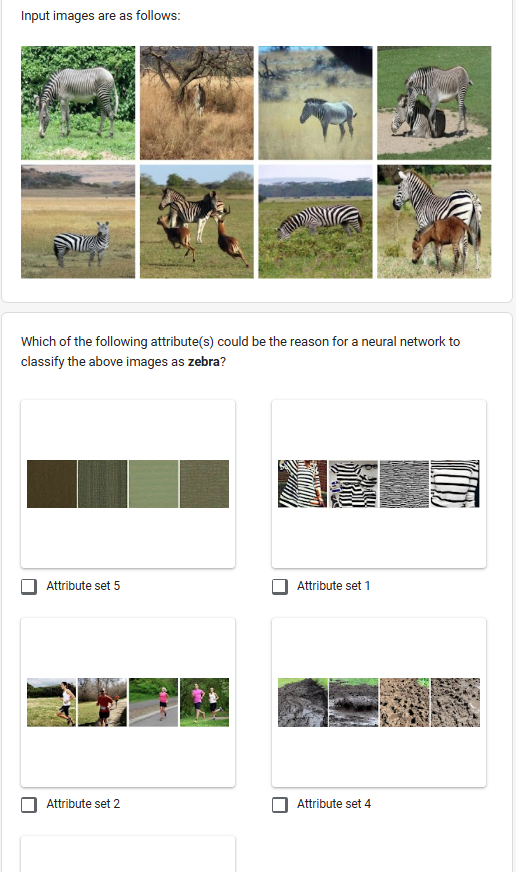
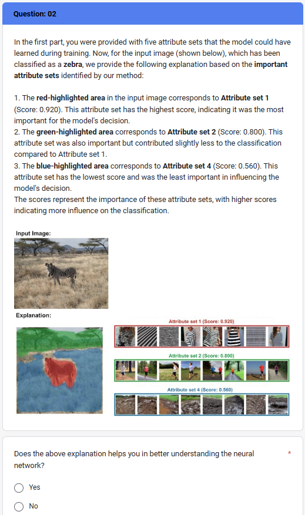
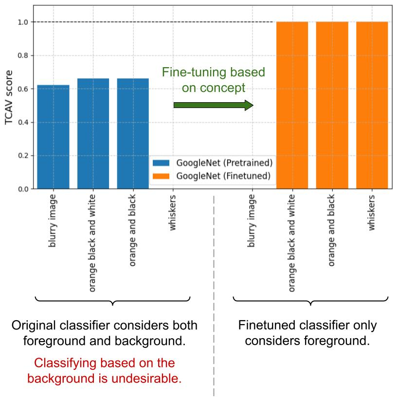

Thank you for your response! We have clarified the reviewer’s questions on the RL optimization routine and usefulness raised by another reviewer below. We have also added new experiments to further bolster the latter. Since we have clarified all previous concerns and new concerns, we sincerely hope the reviewer can reconsider the score. 

## Clarification on the seed prompts
Apologies for the confusion. RL choses one action at a time. But multiple actions will be used as the prompt for stable diffusion. For instance, at t=1, action={cat}, prompt={cat} and at t=2,  action={water}, prompt={cat, water}, and so on. If the combination is not useful (based on TCAV), then the RL will decide not to proceed through this trajectory. Please see Appendix D.3.2 for a plot that shows the number of action combinations used over time. As a side note, please also note that stable diffusion generates a very different set of images for prompt={cat} at t=1 vs. at t=2, because at each timestep, stable diffusion is fine-tuned. Please see the generated samples below to see that updating on one seed prompt at a time without RL does not lead to meaningful explanations.

Images generated after fine-tuning for concept “stripes” for the zebra class with and without RL after 300 steps.

<b>Without RL</b>

  
  
  

<b>With RL</b>

  
  
  

## Clarification on Without RL experiment and results:
We demonstrate the benefits of the sequential approach both conceptually and experimentally. In our benchmark experiment on training the diffusion model without an RL agent, we fine-tuned the same diffusion model for each prompt by going through the seed list in a for loop. If we only had a few seed prompts, we could have trained separate diffusion models. But when we consider the multiple combinations of seeds, it is not feasible to have many diffusion models (if so, for N seeds, we need 2^N diffusion models). Therefore, we have only one diffusion model, and RL decides which optimization trajectories are not useful. The GIF shown below provides a visualization of this sequential process. As illustrated in the results above, if we don’t use RL to optimize, we see that stripes seed does not converge to a good quality concept compared to the one obtained using RL for the same time budget. The main reason for that is, the RL agent learns over time what trajectories are worth optimizing and drops the less explainable trajectories.

  
  
Our proposed algorithm, RLPO, iteratively refines the concepts ci that can be generated by a Stable Diffusion (SD) model by optimizing SD weights based on an action ai. Each step in this update process provides an explanation at a different level of abstraction.

## Clarification on usefulness:
Below we clarify the reviewer's misunderstanding of our primary objective and then present new experimental results. The primary objective of this research is to come up with novel concepts that trigger the neural network (i.e. understanding the neural network). 

> **Our claim:** When considering automated concept set creation techniques (that are retrieval based), the proposed generative method can come up with novel concepts that trigger the neural network (unveiling such new patterns can help engineers fix models).

Experimental evidence to support the claim:
- Quantitative: Table 4 shows that our method can generate new concepts.
- Qualitative: Figure 4 illustrates some results of Table 4.
- Human evaluation: Most humans cannot imagine certain patterns will even trigger the neural network.

We have recently updated the manuscript to clearly specify the contribution. 

Having said that, we now conducted an additional human survey to measure the usefulness of the provided explanation. The experiment is two fold: 

- **Step 1:** We first asked 19 ML engineers to choose relevant generated concepts for Googlenet classifier to classify a zebra class without telling them that all shown images are actual concepts. All the engineers selected the ‘stripes’ concept to be most important while some also selected the ‘mud’ concept. But most missed the ‘running’ concept. This indicates that engineers cannot think of all the important concepts that the neural network gets activated. 
- **Step 2:**  Then we showed engineers the concept-explanation mapping on a random input image (figure 6 in paper) and asked them if the provided explanation helped them understand the model better and if it provided new insights. More than 90% of the engineers agreed that the explanation helped in better understanding the neural network and around 84% agreed that it provided new insights about the neural network that they didn’t have previously. This result clearly suggests that the new concepts discovered by the proposed method help engineers discover new patterns that they did not imagine before.

  
  
   
  
  
   
  
Figure 1:  Screenshots from our human survey.

Taking an additional step, through another experiment, we demonstrate how these new explanations help engineers fix issues in neural networks. 

To further showcase the usefulness, we conducted an additional experiment. In this experiment, we choose a pretrained Googlenet classifier for the Tiger class whose important seed prompts were ‘orange black and white’, ‘orange and black’, and ‘blurry image’ with TCAV scores of 0.66, 0.66, and 0.62, respectively. Out of these seed prompts, ‘orange black and white’ and ‘orange and black’ highlight the tiger pixels while ‘blurry image’ seed prompt highlights the background pixels (see sample explanations below). What that means is, in order to classify a tiger, Googlenet looks at both the foreground and background. 

  
   
  
Figure 2: Explaination mapping between concepts learned and input for pretrained GoogleNet classifier on Tiger class.

Now the engineers want the classifier to classify the tiger based on tiger pixels, not its background (note: from the classical Wolfe-Husky example in LIME [1], we know the spurious correlation of background). To this end, we generated 100 tiger images based on concepts related to ‘orange black and white’ and ‘orange and black’ using a separate generative model and fine-tuned our Googlenet model. Running RLPO on this fine-tuned model revealed that the model learned some new concepts such as ‘whiskers’ and also revealed that previous concepts such as ‘orange black and white’ and ‘orange and black’ are now more important with TCAV scores of 1.0 and 1.0, respectively. This means that the classifier is now only looking at tiger pixels, not the background. (see dataset samples and shift plot below). This experiment clearly shows how the proposed method can be used to improve a neural network’s undesirable behavior.

1. Ribeiro, Marco Tulio, Sameer Singh, and Carlos Guestrin. "" Why should i trust you?" Explaining the predictions of any classifier." Proceedings of the 22nd ACM SIGKDD international conference on knowledge discovery and data mining. 2016.

  
   
  
Figure 3: Dataset samples.

  
   
  
Figure 4: Fine-tuning based on important concept.

