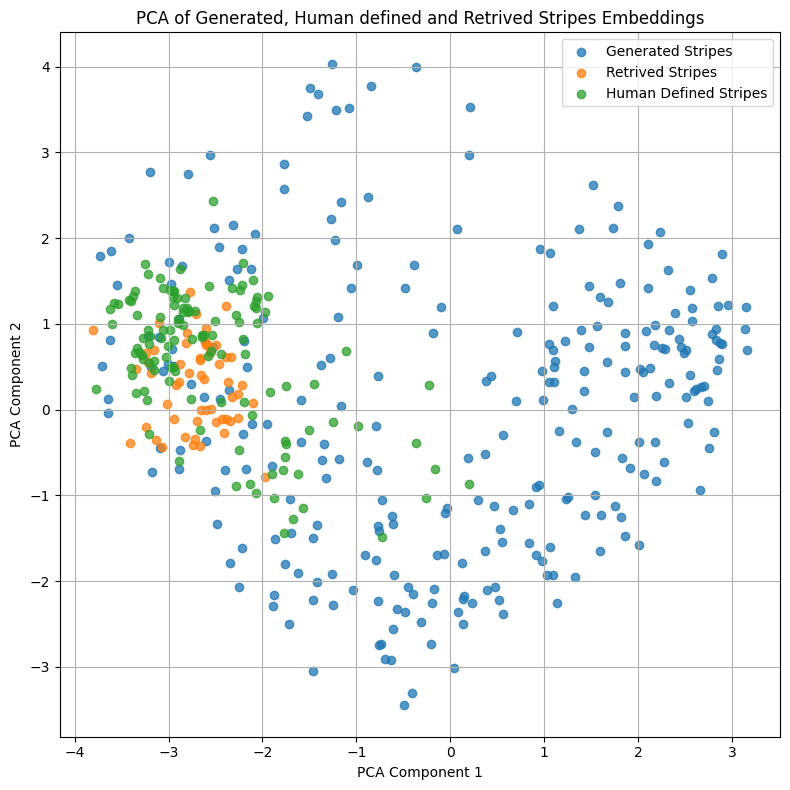

Thank you for your thoughtful review and for recognizing the technical soundness and novelty of our framework. We appreciate your critical insights and provide detailed clarifications below:

### Q1: Concerns about seed prompt acquisition.

We agree with the reviewer’s observation that our current setup is primarily focused on low-level visual concepts. But our current setup can easily be modified to capture higher-level semantic concepts (e.g., gender, age) by adding task specific questions like, “What is the gender of the person in the image?” or “Which age category does the person in the image belong to (young/old)?”. 

To verify the usability of the proposed methodology with higher-level semantic concepts like gender, we trained a Resnet18 classifier on CelebA dataset to classify images as “Blonde” and “Not Blonde”. This dataset is known for having a spurious correlation between class “Blonde” and females. With our method, we were able to find the same correlation. Concepts  generated for the female face were more important than male face. As a side note, when we train RLPO to capture higher-level semantic concepts, it starts combining one or more than one low-level features. As shown in examples, the generated samples start developing long and blonde hairs for both male and female concepts.

  

<b>Sample Female Face Generated Concept:</b>

  
  
  

<b>Sample Male Face Generated Concept:</b>

  
  
  

### Q2: Concerns regarding limited evaluation.

We would like to clarify that, while the main text includes examples like “zebra” and “tiger” for clarity and interpretability, RLPO was evaluated on a broader range of randomly selected samples from ImageNet (see Section 4.3, Appendix D.3, and Table 4). RLPO has also been tested on multiple pretrained models such as GoogleNet, InceptionV3, indicating RLPO is not tied to a specific architecture. 

Additionally, as mentioned in Appendix D.9, rather than predominantly featuring specific cases, while conducting the human survey we considered 10 unique classes and randomly selected examples. Apart from that, we also demonstrate how RLPO generalized to non-visual domains like sentiment analysis (see Section 4.6 and Fig. 8).

### Q3: Justification for the assumption that CH⊆CG and CR⊆CG.

Iniutively, the generative models like Stable Diffusion are trained to learn the distribution of real-world data (which contains human defined and retrieved concepts). By leveraging this learned distribution, they can create existing or new data which by design can represent human defined or retrieved concepts (or neither). That being said, to solidify this assumption we plotted the clip embeddings of generated, retrieved and human defined stripes concept. For retrieval based concepts we used the stripes collected by CRAFT for the zebra class, for human defined concepts we used the concepts collected by TCAV authors for the zebra class, and for generated concepts we used pre-trained stable diffusion 1.5 to generate random stripes images. As shown in the plot, the generated stripes encapsulates both human-defined and retrieved concepts hence proving the assumption CH⊆CG and CR⊆CG.

  

